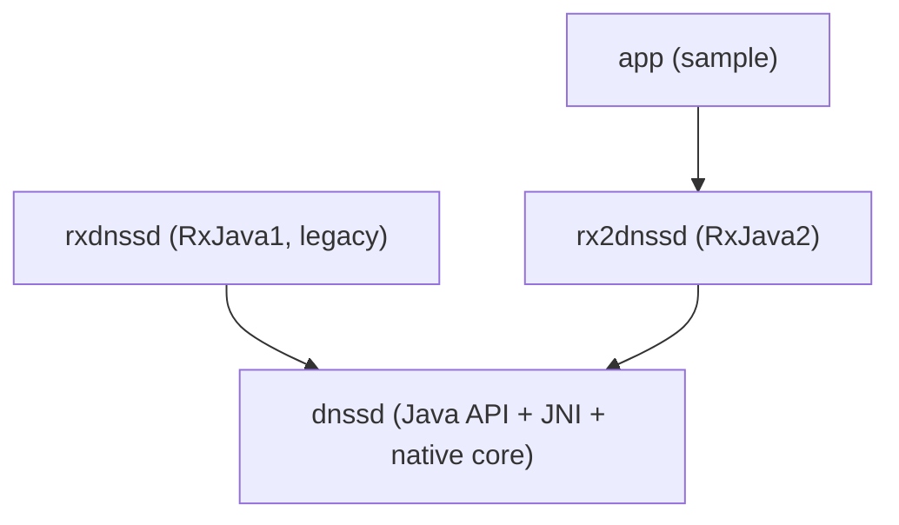

# AGENTS.md

## Project snapshot

RxDNSSD is an Android library set implementing a DNS-SD/mDNS (Bonjour/Zeroconf) client, published as three Maven artifacts from one repo. Stack: Java 8 (Android), Gradle (Android Gradle Plugin 7.0.3), native C (NDK 28.2.13676358, vendored Apple mDNSResponder), RxJava 1 and RxJava 2. **Archived project** — see the Ukraine notice at the top of `README.md`; DisplayNote maintains an internal fork (see `docs/architecture.md` "Active decisions").

## Repository map

```
.
├── app/          Sample Android app demonstrating rx2dnssd usage. Not published.
├── dnssd/        Plain-Java DNS-SD API + JNI bridge + vendored native mDNSResponder core.
├── rxdnssd/      RxJava 1 wrapper over dnssd. Legacy — see Gotchas.
├── rx2dnssd/     RxJava 2 wrapper over dnssd. Use this for new integrations.
├── docs/         architecture.md, per-module docs, runbooks, glossary (this doc set).
├── BUILD.md      Local-build and publish toggle instructions.
└── circle.yml    CircleCI config (only CI in this repo; no GitHub Actions workflow).
```

Full per-module detail: `docs/modules/dnssd.md`, `docs/modules/rxdnssd.md`, `docs/modules/rx2dnssd.md`, `docs/modules/app.md`.

## Run / build / test / lint

Prerequisites: Android SDK, NDK 28.2.13676358, JDK 17. See `docs/runbooks/local-setup.md` for the full setup including a Windows/Git Bash `JAVA_HOME` gotcha.

```bash
./gradlew clean build     # full build, all 4 modules
./gradlew test            # unit tests, all modules
./gradlew :dnssd:test      # single module
./gradlew check            # what CircleCI runs
```

Before your first local build, read `BUILD.md` — `rxdnssd`/`rx2dnssd` ship with `api project(':dnssd')` active (correct for local dev), which must be swapped for a Maven coordinate before publishing (`docs/runbooks/release.md`).

No standalone lint/format command beyond `lintOptions { abortOnError false }` in `app/build.gradle` (lint failures don't fail the build).

## Architecture overview



- **`dnssd`**: `DNSSD` interface with two implementations — `DNSSDBindable` (talks to the system `mdnsd`/`nsd` daemon, deprecated by Google on API 31+) and `DNSSDEmbedded` (runs its own native mDNSResponder core via JNI, works API 14+). Native core under `dnssd/src/main/jni/mdnsresponder/` is vendored Apple source — do not hand-edit.
- **`rxdnssd`** / **`rx2dnssd`**: near-identical Rx wrappers (RxJava1 `Observable` vs RxJava2 `Flowable`) over `DNSSD`. They do not depend on each other.
- **`app`**: sample activity (`DNSSDActivity`) showing the canonical `browse().compose(resolve()).compose(queryRecords())` chain.

Full diagrams (C4 + sequence): `docs/architecture.md`.

## Coding conventions (observed)

- Package-private `Internal*` classes (`InternalDNSSD`, `InternalBrowseListener`, …) are native-method plumbing, never part of the public API surface — don't call them from outside `dnssd`.
- Public interfaces (`DNSSD`, `RxDnssd`, `Rx2Dnssd`) are documented with Javadoc `@param`/`@return`; match that style when adding methods.
- `@Deprecated` methods (e.g. `queryRecords()` in both Rx wrappers, replaced by `queryIPRecords()`) are kept, not removed, for binary compatibility — follow that pattern rather than breaking existing consumers.
- Tests: one JUnit4 test class per public entry point, using Mockito + PowerMock to stub native calls (`docs/runbooks/testing.md`).
- Apache 2.0 license header on every source file — copy an existing file's header verbatim into new files.

## Patterns to follow / anti-patterns to avoid

- **Follow**: when adding an operation to `Rx2Dnssd`, implement it in both `Rx2DnssdBindable` and `Rx2DnssdEmbedded`, then port the same addition to `RxDnssd`/`RxDnssdBindable`/`RxDnssdEmbedded` unless it's RxJava2-only by nature (see `docs/modules/rx2dnssd.md`).
- **Avoid**: adding a dependency between `rxdnssd` and `rx2dnssd`, or between either of them and `app`'s reverse direction.
- **Avoid**: editing files under `dnssd/src/main/jni/mdnsresponder/` for anything but a deliberate upstream sync — see Gotchas below.
- **Avoid**: changing the local/publish `dnssd` dependency toggle in `rxdnssd`/`rx2dnssd` `build.gradle` without also updating `BUILD.md`/`docs/runbooks/release.md` if the mechanism itself changes.

## Where to add X

| Adding... | Go to | Pattern to follow |
|---|---|---|
| A new DNS-SD primitive (Java-level) | `dnssd/.../DNSSD.java` + both implementations | See `docs/modules/dnssd.md` |
| A new Rx operator/query (RxJava2) | `rx2dnssd/.../Rx2Dnssd.java` + `Rx2DnssdBindable`/`Rx2DnssdEmbedded` | Then port to `rxdnssd` — see `docs/modules/rx2dnssd.md` |
| A unit test | `<module>/src/test/java/.../<Module>Test.java` | Mockito + PowerMock, see `docs/runbooks/testing.md` |
| A sample UI flow | `app/src/main/java/.../DNSSDActivity.java` | Extend existing activity unless a new flow is genuinely separate |
| A native/JNI change | `dnssd/src/main/jni/JNISupport.c` + `DNSSD.java.h` | Never touch `mdnsresponder/` except for deliberate upstream sync |

## Gotchas

- **Manual publish toggle**: `rxdnssd`/`rx2dnssd` `build.gradle` files require hand-editing between `api project(':dnssd')` (local) and a Maven coordinate (publish) — no automated switch, easy to publish against a stale `dnssd` artifact or forget to revert. See `docs/runbooks/release.md`.
- **Vendored native core**: `dnssd/src/main/jni/mdnsresponder/` is third-party Apple source (includes unused mDNSWindows/Clients trees) — treat as read-only except for controlled upstream syncs.
- **Two coordinate spaces**: historical Maven Central releases used `com.github.andriydruk`; this fork publishes as `com.displaynote.dnssd` (`publish-root.gradle`). Don't assume version numbers or artifact history are shared between the two.
- **`DNSSDBindable`/`Rx*DnssdBindable` deprecated by the OS** on `targetSDK 31`+ (Android 12) — new integrations should default to the Embedded variants.
- **Windows `JAVA_HOME` quoting bug**: see `docs/runbooks/troubleshooting.md` — a quoted env var value can make Gradle report a valid JDK directory as invalid.
- **No GitHub Actions**: CI is CircleCI only (`circle.yml`); there's no workflow under `.github/workflows/` (`.github/` holds an issue template and `copilot-instructions.md`).

## Glossary

See `docs/glossary.md` (DNS-SD, mDNS, mDNSResponder, Bindable vs Embedded, BonjourService, etc.).

## External systems

| System | Role | Configured in |
|---|---|---|
| Artifactory (DisplayNote) | Maven publish target for `dnssd`/`rxdnssd`/`rx2dnssd` | `publish-root.gradle`, `publish-module.gradle`, credentials via `gradle.properties` or env vars |
| CircleCI | CI: `androidDependencies` + `check`, uploads test reports | `circle.yml` |
| Android system `mdnsd`/`nsd` daemon | Backing service for `*Bindable` implementations (deprecated API 31+) | No repo config — OS-provided, bound via `Context` at runtime |
