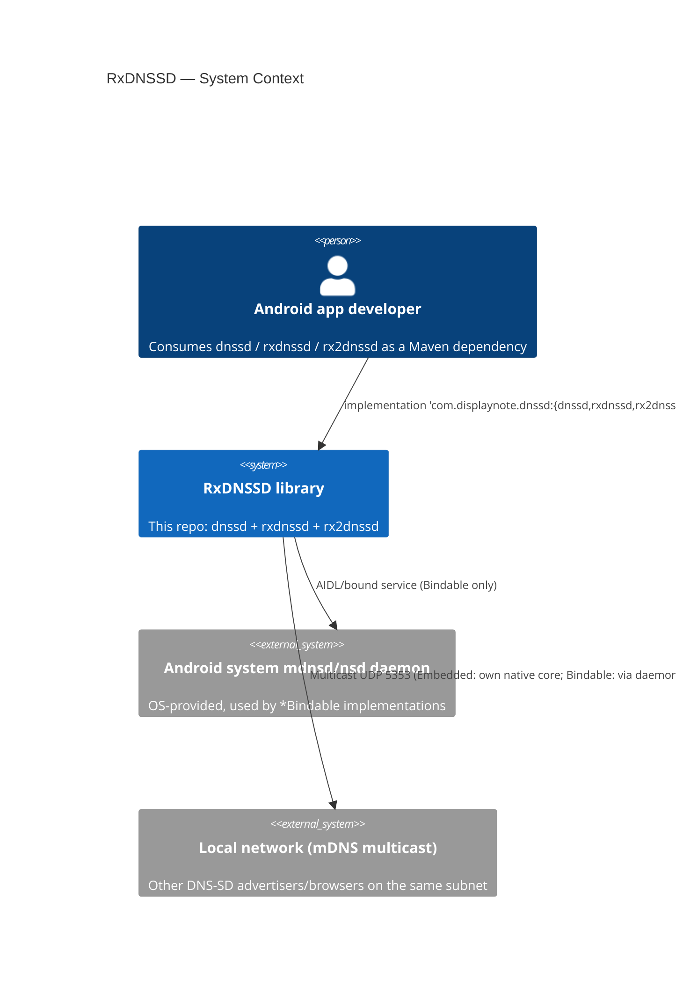
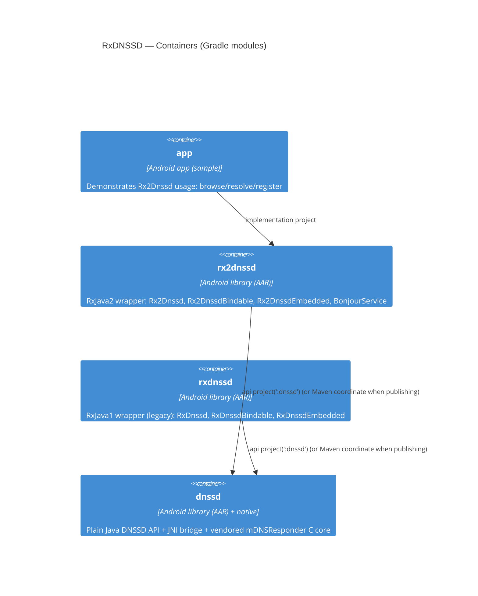
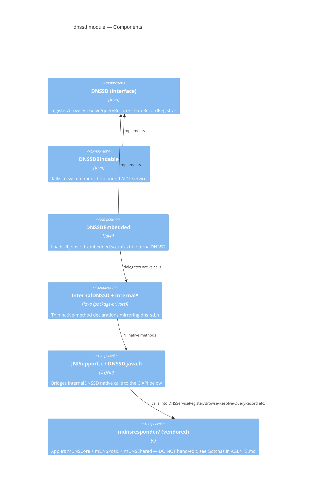
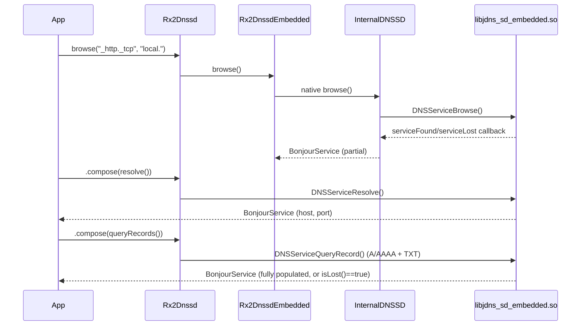

# Architecture

See `docs/glossary.md` for term definitions (DNS-SD, mDNS, Bindable vs Embedded).

## Context

## Containers

`rxdnssd` and `rx2dnssd` do not depend on each other; both wrap `dnssd` independently. Never add a dependency between them.

## Components — inside `dnssd`

## Data flow — browse → resolve → query (Rx2, Embedded)

## Native build

`dnssd/build.gradle` wires `externalNativeBuild.ndkBuild` to `dnssd/src/main/jni/Android.mk`. Two native targets are built (see `Android.mk`):
- `jdns_sd_embedded` — full mDNSCore + mDNSPosix + JNISupport, used by `DNSSDEmbedded`.
- (bindable path uses the plain `dnssd_client*` shim files, no full core, talking to the system daemon over a Unix domain socket via IPC — see `mDNSShared/dnssd_ipc.c`).

NDK version is pinned per-module in `build.gradle` (`ndkVersion "28.2.13676358"` in `app` and `dnssd`).

## Active decisions

- **Local vs published dependency switch** (`BUILD.md`): `rxdnssd/build.gradle` and `rx2dnssd/build.gradle` both declare `dnssd` as `api project(':dnssd')` for local builds; the commented-out alternative (`api "${rootProject.ext.groupId}:dnssd:${version}"`) is swapped in manually before publishing. There is no automated toggle — this is a manual, error-prone step, see Gotchas in `AGENTS.md`.
- **Group ID migration**: `groupId` in `publish-root.gradle` is `com.displaynote.dnssd` (internal Artifactory fork), while historical Maven Central releases used `com.github.andriydruk` (see `README.md` badges). The two coordinate spaces are not interchangeable.
